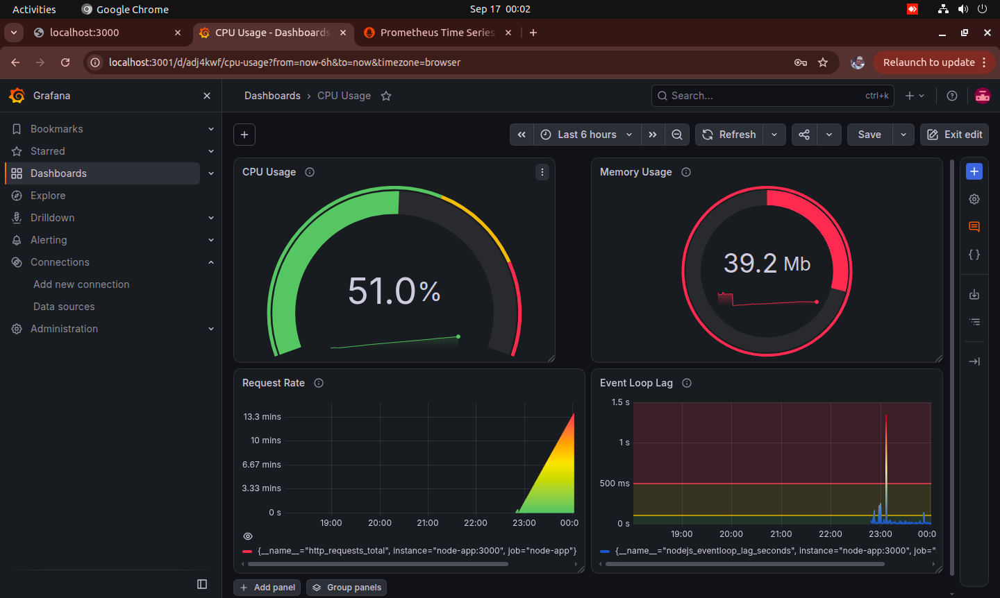

# Node.js App Health Dashboard
## Overview
This project demonstrates how to monitor a Node.js application using **Prometheus** and **Grafana** inside Docker.  
It acts like a fitness tracker for software, tracking requests, CPU usage, memory consumption, and event loop lag in real time.


## Project Structure
```bash
.
├── app.js               # Node.js sample app exposing metrics
├── Dockerfile           # Instructions to build the Node.js app container
├── docker-compose.yml   # Orchestrates Node.js, Prometheus, Grafana services
├── prometheus.yml       # Prometheus scrape config to pull metrics from node-app
├── package.json         # Node.js dependencies and scripts
├── package-lock.json    # Dependency lock file
├── README.md            # Documentation of setup and usage
└── screenshots/         # Dashboard screenshots 

```
## Setup Instructions
### 1. Clone the repository.

Get the project files onto your machine:

```bash
  git clone https://github.com/Decnj/nodejsApp-monitoring.git
  cd nodejsApp-monitoring
```


### 2. Build and Start Services.
Use Docker Compose to spin up Node.js, Prometheus, and Grafana:

```bash
  docker-compose up --build 
```
Wait for the containers to start.


### 3. Access the services.
Open each service in your browser:

- Node.js app → http://localhost:3000 
- Prometheus → http://localhost:9090 
- Grafana → http://localhost:3001


### 4. Log into Grafana
Use default credentials to access Grafana:
- Username: admin
- Password: admin
Change password after first login


### 5. Create Dashboard Panels
Add the panels for each metric:
- Line chart: rate(http_requests_total[1m])

- Circular gauge: CPU % (rate(process_cpu_user_seconds_total[1m])*100)

- Circular gauge: Memory MB (process_resident_memory_bytes/1024/1024)

- Time series: Event loop lag (nodejs_eventloop_lag_seconds)


### 6. Dashboard Screenshots
Below are the key panels from the Grafana dashboard, each showing a different aspect of the Node.js app health:

- Request Rate: Line chart showing the rate of incoming HTTP requests over time.

- CPU Usage: Circular gauge displaying CPU usage as a percentage, with thresholds for healthy, warning, and critical states.

- Memory Usage: Circular gauge showing resident memory usage in MB, useful for spotting leaks or excessive consumption.

- Event Loop Lag: Time series graph showing Node.js event loop lag in seconds, highlighting responsiveness issues.


